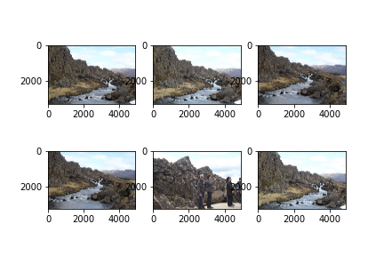
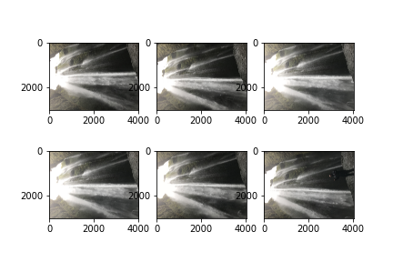
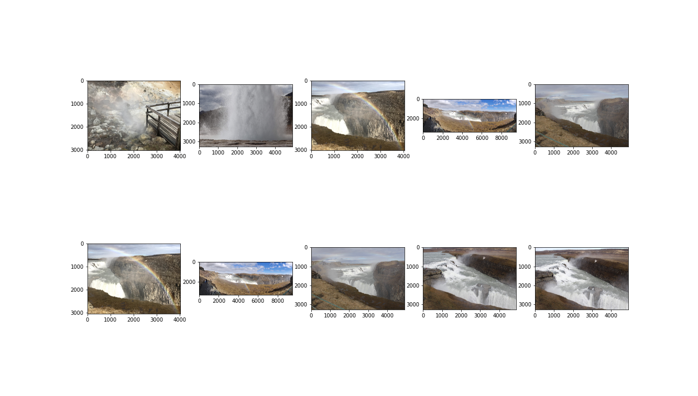

# Idea 3 - K-means Clustering of Image Feature Vectors

## Motivation

_Turi Create_ was a bust, but they mention something at the end of their [guide](https://apple.github.io/turicreate/docs/userguide/image_similarity/) that motivates the following idea.
They list the 3 steps that explain how their image similarity model works:

1. Obtain a pre-trained CNN classifier and rip out the last layer

2. Run our images through this modified CNN classifier, this gives us our feature vectors!

3. Now, we can create (in their case) a nearest neighbors model using the output of step 2.

i.e. Let's do transfer learning and just tweak step 3 so that we solve the problem we set out to solve.

## The Work

We follow the above 3 steps fairly closely in `image_clustering.ipynb`, as such I will leave parsing the code as an exercise for the reader.
(There's also nothing crazy going on there)
We should, however, explain where a magic number came from!
```
kmeans_model = KMeans(n_clusters = 600).fit(image_feature_vectors)
```
Where does the 600 come from?
We use the elbow method (which is why the `calculate_WSS` function exists at the very end) with progressively smaller step sizes between the _k_ values until I guess-timated that 600 would be close enough to the elbow. 

## Results

Just how good was the clustering?
You can see for yourself:
<div style="text-align: center">
    
    
    
</div>

The first 2 clusters are pretty good. (Let's ignore that the 2nd cluster is actually low hanging fruit).
The last cluster is a bit more wild, but there are subsets of images within that cluster that we can deem "similar"

The wildness in that last cluster is most likely a consequence of my guesstimate.
Had I properly run the elbow method and taken the time, I could probably refine that _k_ parameter to something more optimal.
For the most part however, I'd say this idea was pretty successful!

Just one last thing to do now: Flush out Idea #1 and do one last comparison with this idea!
[Follow me!](https://github.com/nicholaspun/similar-images-purger/tree/master/showdown)