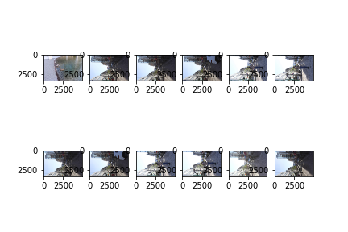
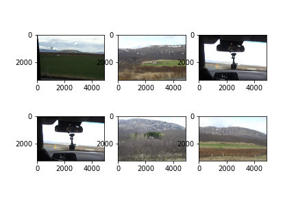
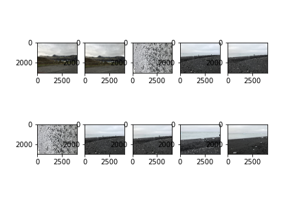
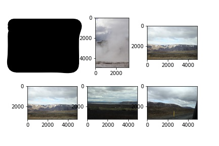

# Showdown between Idea #1 and Idea #3

First, we fulfill our promise we made near the end of the README for Idea #1 and create a working notebook that pulls out unique images using both the histogram and averaged-distance approach.
This is all in `image_distance.ipynb`. (Note that we call the histogram approach `angular_distance` and the averaged-distance approach `averaged_distance`)
Effectively what we're doing here is our own clustering algorithm using feature vectors and metrics that we've defined.

A note on the actual methodology and code---what has been coded up is a _very_ naive approach to clustering.
In particular, we make a spatial locality assumption that images of the same cluster will appear next to each other (i.e. the image files get placed next to each other when in alphabetical order).
It's not _too_ crazy of an assumption to make.
An easy class of similar photos are those taken one after another by us mashing the capture button on our phone.
The filenames for these photos will be, not surprisingly, one after another when sorted in alphabetical order.

The main reason for this assumption is that if I don't make it, the notebook takes way too long to run and I'm way too lazy to wait that long. 

Now, with that aside, onto the results!

## Results of Idea #1

### Histogram/Angular Distance Approach
I'll show some figures right off the bat:

    
    

The first image is a "good" cluster and the second image is a questionable cluster.
I'm very not surprised at the result of the good cluster as just looking at the images, they seem to have roughly the same distribution in color.
And indeed, the histogram approach picked this up!

On the questionable cluster, I'm a bit more surprised.
The images in the top-right and top-left corners have a higher range of tones, so I expect that the histograms are bimodal, while the remaining images have relatively uniform-looking histograms.
The fact that this wasn't enough for their angular distance to be far apart is a bit surprising.
Nevertheless, that's just my photographer's eye providing me with a heuristic, our machine clearly saw something else between these histograms.

We also note that using this method, we pick out 1592 unique images ... which is a tad bit more than the 600 we picked out using k-means

### Averaged Distance Approach
Again, the first image is a "good" cluster and the second image is a "bad" cluster

    
    

(My friend got included in this cluster, so I'll have to censor that image out.
Try not to let the big blob distract you :P)

Both clusters bring a little bit of surprise.
The are two images in the good cluster that clearly look out-of-place and I'm surprised that the distance between them and the rest of the images is so low.
I think this is due to the lack of colour in these images.
Nevertheless, this is a sizeable cluster of similar-looking images, so yay!

The bad cluster is not that bad if you only look at the five remaining images.
The problem was my friend being included in the cluster since I would have expected a person wearing non-grey clothing and doing a double thumbs-up into the camera would have a greater distance between the remaining images.
But, here we are though I guess.

And, we'll make a similar note here that this method picks out 1332 unique images.

## Discussion
So, what does this all mean? (_Insert double rainbow joke here_)
Erm, nothing really, it was just a fun experiment.
We note that although the 2 ideas seem vastly different, they're really both just clustering algorithms with different input parameters.
Given my ad-hoc methods in clustering for Idea #1, it would be great if we could actually generalize the pre-existing algorithm for arbitrary metric spaces.

_(No doubt this probably exists, I didn't bother Googling for this though)_

_(I guess I'd also have to show you that the approaches in Idea #1 do actually yield metric spaces . . . ANYWAY)_

Did this solve the problem I set out to solve? Sorta.

Did this achieve the task I set for myself? This one, yes.

But yeah, that's all I have.
Nothing much more to discuss here.
We surveyed 3 different ways to cluster images using both simple and more _convoluted_ (hehe) tools and they all worked to varying degrees.
Whether you're someone who's looking for a way to solve this exact problem or someone who just stumbled upon this repo, hopefully this has been an interesting journey. * bows *